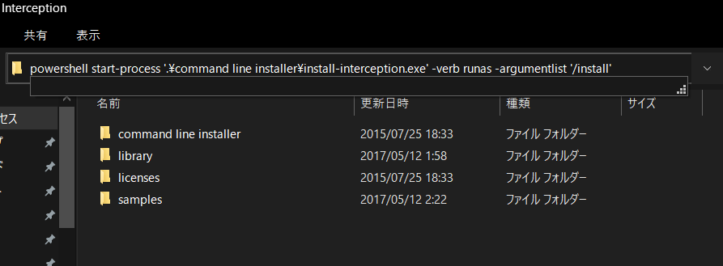

# aula-interception

[Interception](https://github.com/oblitum/Interception) module for [Aula Script Engine](https://github.com/amenoyoya/aula)

## Environment

- OS:
    - Windows 10
- Build tools:
    - Microsoft Visual C++ 2019 Community Edition
- Editor:
    - VSCode

### Setup: Interception
- **Interception**:
    - マウスやキーボード等の Human Interface Device (HID) の入力を傍受する仮想ドライバ
    - ドライバは、フリー版ではソースコード非公開のため、ドライバが安全かどうかは各自判断する必要がある
- Setup:
    - https://github.com/oblitum/Interception/releases/download/v1.0.1/Interception.zip をダウンロードして解凍する
    - 解凍したディレクトリ内でエクスプローラのアドレスバーに `powershell start-process '.\command line installer\install-interception.exe' -verb runas -argumentlist '/install'` と入力して実行
        - 
    - ドライバインストールを完了するために、PCを再起動
- アンインストール方法:
    - `powershell start-process '.\interception\command line installer\install-interception.exe' -verb runas -argumentlist '/uninstall'`

***

## Execution

```powershell
> aula.exe .\samples\interception.lua
```
